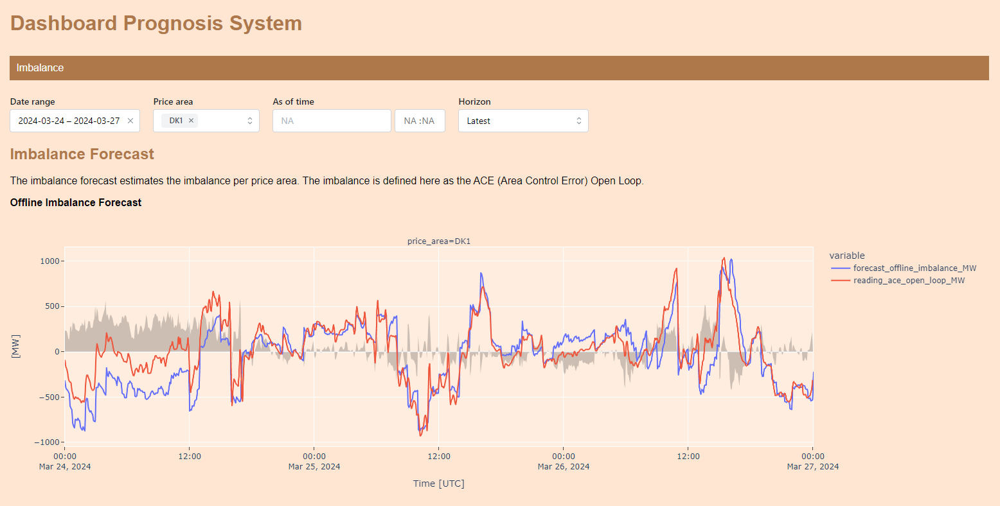

# Dashboard

PoC project for Dash application instead of Databricks dashboards.

Currently only includes example for the offline imbalance forecast, allowing one to choose:

1. Date range
2. One or more price areas
3. Horizon (for analyzing the performance of a forecast e.g. 15 minutes/1 hour/2 hours before the operational quarter)
4. As-of-time (for analyzing how the forecast looked at a specific point in time, e.g. yesterday at noon)

## How to run?

```bash
pip install -r requirements.txt
python -m app
```

## Screenshot

